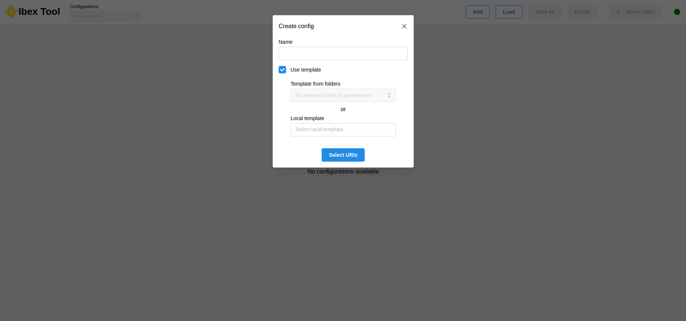

.. _`Add configuration`:

===================
Add configuration
===================

The “Add” button allows you to create a new configuration; you just need to provide a name for it.

It is possible to create a configuration from a template. To do this, you must tick the “Use template” box and then select a configuration file.

There are two ways to do this:

* The first is to select a configuration from a list of predefined folders in the user preferences (see :doc:`Preferences <preferences_menu>`).
* The second option is to select a local file directly from your machine.

Once the configuration has been created, it will then be necessary to add URIs (see :doc:`Add uri <add_uri>`).