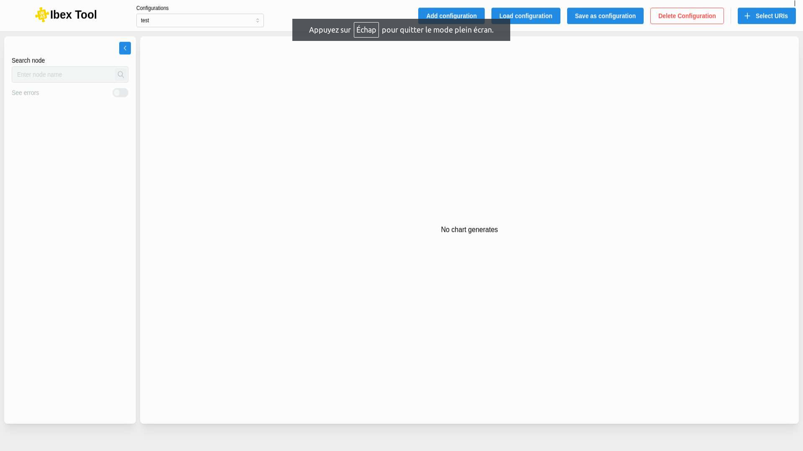
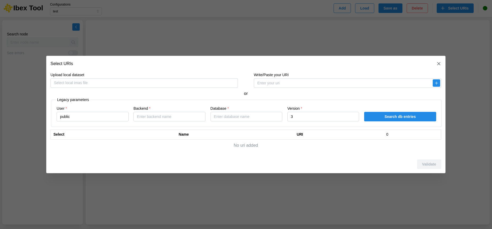

.. _`Add uri`:

===================
Add uri
===================

When a configuration becomes accessible to the user, the window will be completed.
On the left, you will find the different hierarchies of the selected URIs.
On the right, there will be a draggable canvas displaying the various charts that have been generated based on the data from the hierarchy.

To add a URI, you can click the “Select URIs” button at the top right of the window, It will open a modal with fields to fill in.

Thanks to this modal, you can retrieve URIs in different ways :

**From a file (Upload local dataset):**

Upload a file using the input from the file explorer, and then the list of URIs will appear in the table below.

**From the input (Write/Paste a URI):**

Write or copy-paste an existing URI and add it to the table below. A request will verify if a URI exists and is valid.

**From configurable inputs (Legacy parameters):**

This component can receive several parameters (User, Backend, Database, Version). You must provide at least two parameters (User and Version).

UDA Support
-------------

.. important::

   The default mode for the UDA backend in IMAS Core is to download the complete IDS. With the IBEX architecture, it means that the full IDS is downloaded by UDA (by default) with every call from the frontend to the backend.
   Users need to provide the UDA backend option cache_mode=none or fetch=1 (depending on the desired behaviour) in the UDA URI provided to IBEX to allow for a performant visualization.
