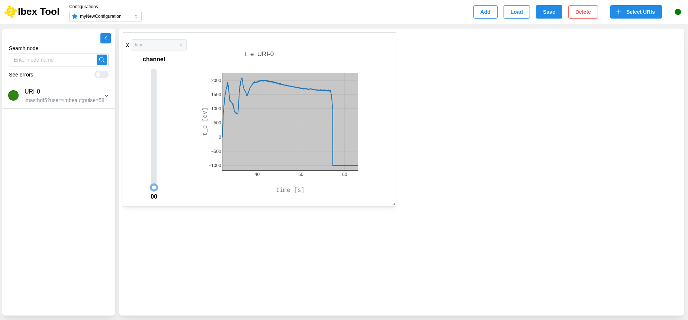

.. _`Default configuration`:

=======================
Default configuration
=======================

It is possible to set a default configuration. This allows the desired configuration to open automatically when the application starts up.

To do this, simply click on the star to the left of the active configuration. Only one default configuration is possible.

