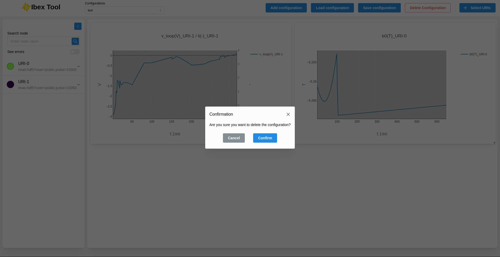

.. _`Delete configuration`:

===================
Delete configuration
===================

You can delete the current configuration by clicking the red "Delete Configuration" button.

A confirmation message will appear to confirm your choice.

If you plan to reuse a configuration later, make sure to save it first.

