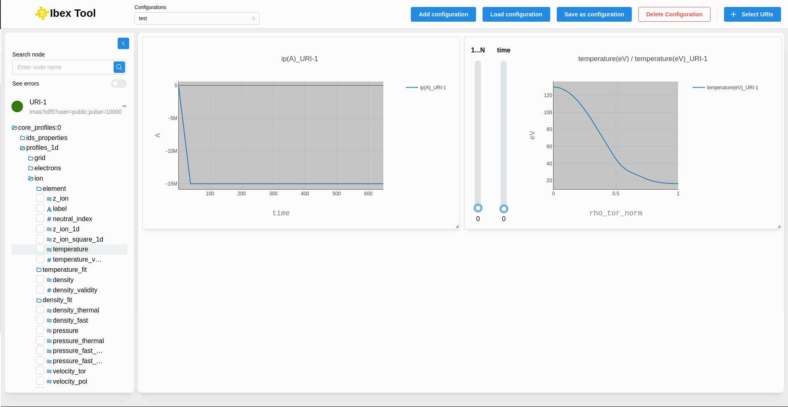

.. _`Draggable component`:

===================
Draggable component
===================

The right section displays the draggable component, which allows for drag-and-drop of elements. In our case, it will be charts. It provides better and simpler management of the space occupied.

You can enlarge and move the chart as needed.

Each chart includes several options:

.. image:: images/plot_data_slider.png
   :alt: Plot data with slider
   :align: center

**Inspect Metadata:**

This opens a ":doc:`Metadata <metadatas>`" component that displays various information related to all nodes (path, min, max, average, value, coordinates, etc.). This gives the user a broader overview of the data.

**Edit Grid:**

This option allows the user to edit the grid (add or remove nodes), if applicable to their use case.

**Drag Plot / Stop Drag & Zoom In-Out:**

This option helps the user focus on a specific chart. In "Drag" mode, the chart can be moved within the draggable area, and the grid size can be adjusted.

To zoom in or out, the grid must be in "Stop Drag" mode. Simply click the button again to toggle the state. In this mode, the user can zoom, pan, take a screenshot of the chart, and navigate within the chart and its axes.

**Delete Grid:**

This option allows the user to remove the grid from the draggable area.