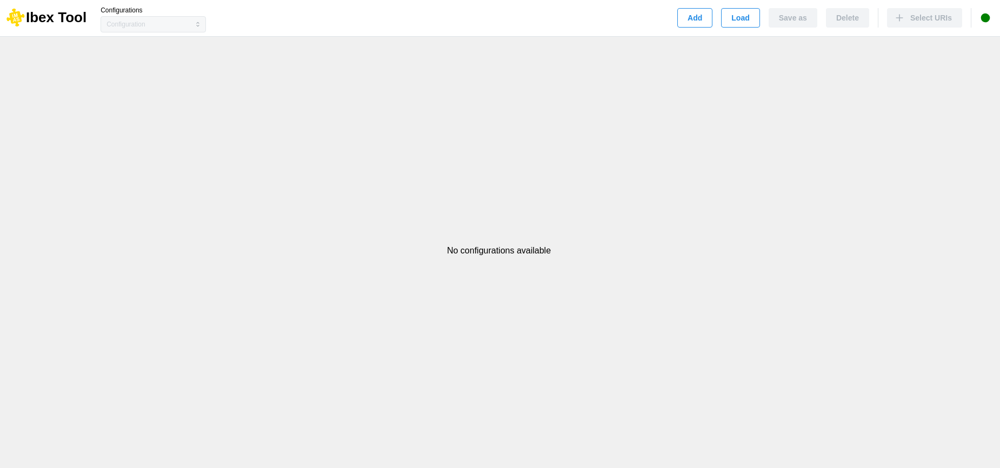

.. _`First window`:

===================
First window
===================

At the launch of the application, you will see this window: 

On this screen, you will be required to either create a new configuration (“:doc:`Add <add_configuration>`”) or load an existing one from your local machine (“:doc:`Load <load_configuration>`”).

The commands at the top left, before the separator, allow you to manage your current configuration (create, save, delete). You can switch between configurations using the selection menu.

To the right of the separator, you can add new URIs (see :doc:`Add uri <add_uri>`).

On the far right, a dot indicates the server status.