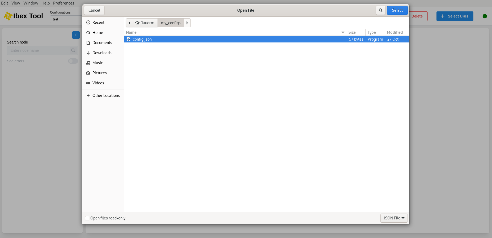

.. _`Load configuration`:

===================
Load configuration
===================

To load an existing local configuration, you can use the “Load” button to find the corresponding “.json” file using the file explorer. This configuration reflects the state of your application at the time of the last save.

Make sure to save your configuration by clicking the “Save” button so that you can load it later and pick up right where you left off. 

When loading a configuration, the data must match the expected JSON format to be valid.
 