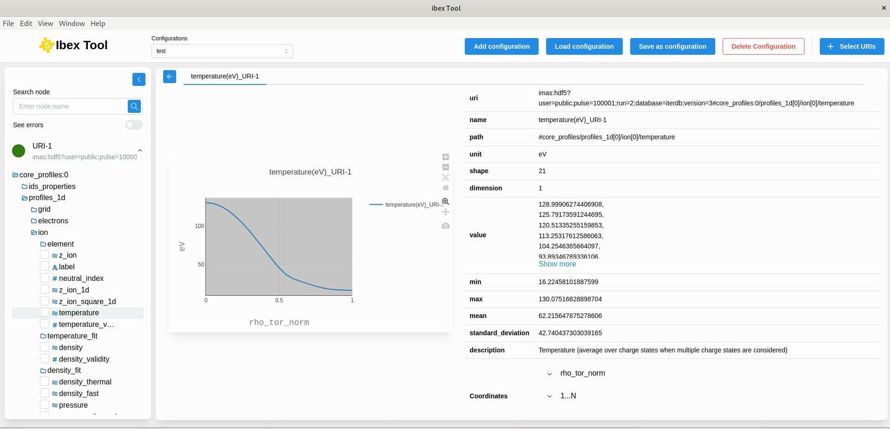
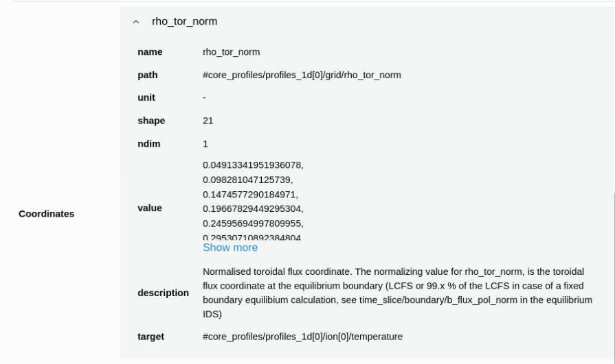

.. _`Metadatas`:

===================
Metadatas
===================

You can view all the data related to this chart.

The metadata includes all available information related to the various nodes displayed on the chart.

The following data fields are available:

* uri

* name

* path

* unit

* shape

* dimension

* value

* min

* max

* mean

* standard_deviation

* description

* coordinates

The coordinates contain all data that can be used on the X-axis or with sliders. 

These include:

* name

* path

* unit

* shape

* ndim

* value

* description

* target
