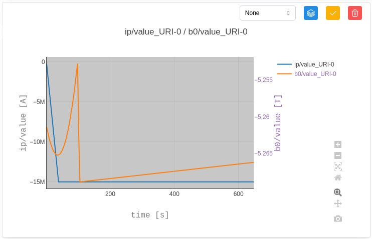
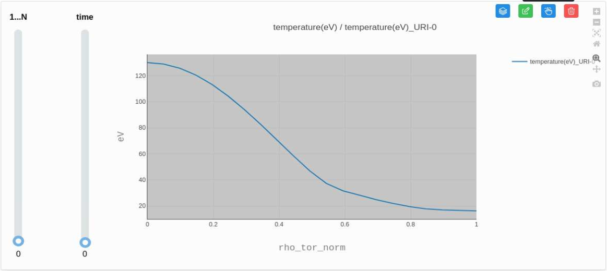

.. _`Plot data`:

===================
Plot data
===================

To plot a data point on a chart, simply click on the corresponding node in the tree. Each node is preceded by a checkbox : you can either click the checkbox or directly click the node name. This will create a component in the draggable area on the right.

You can plot 1D charts with one or multiple nodes, as long as they share the same X-axis. Up to two different Y-axes can be displayed simultaneously.

For certain time-dependent data, one or more sliders will be available to visualize changes over time.

By default, the chart title is generated using the node's name, unit, and associated URI. The Y-axes are labelled with the name of the first plotted plot and their unit. Finally, the X-axis is labeled with the name used to retrieve coordinates and his unit. Each data series is distinguished by a default color.

