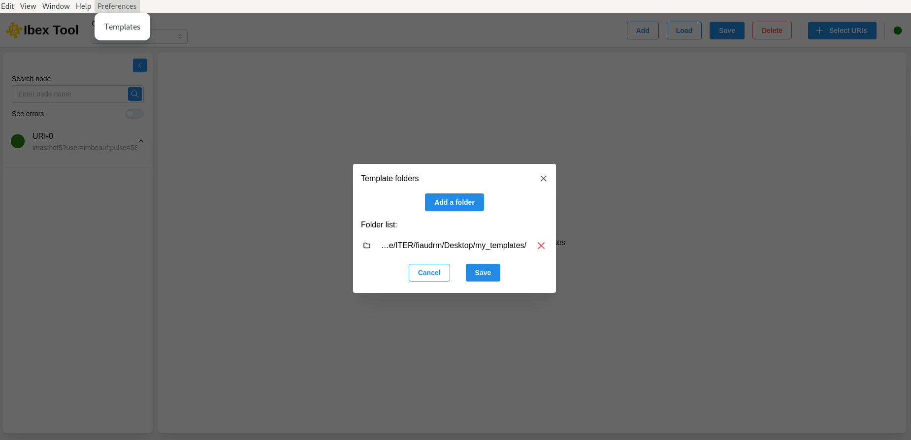
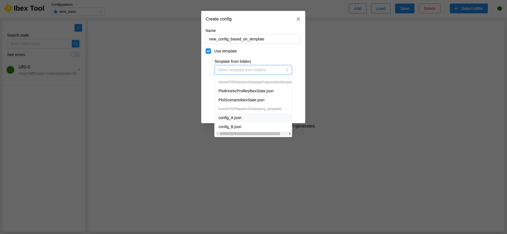

.. _`Preferences menu`:

===================
Preferences menu
===================

The user preferences menu includes template folder management. This allows you to define the location of template folders.

Once defined, when creating a configuration, the selectable templates will be accessible in the "Template from folders" list.

