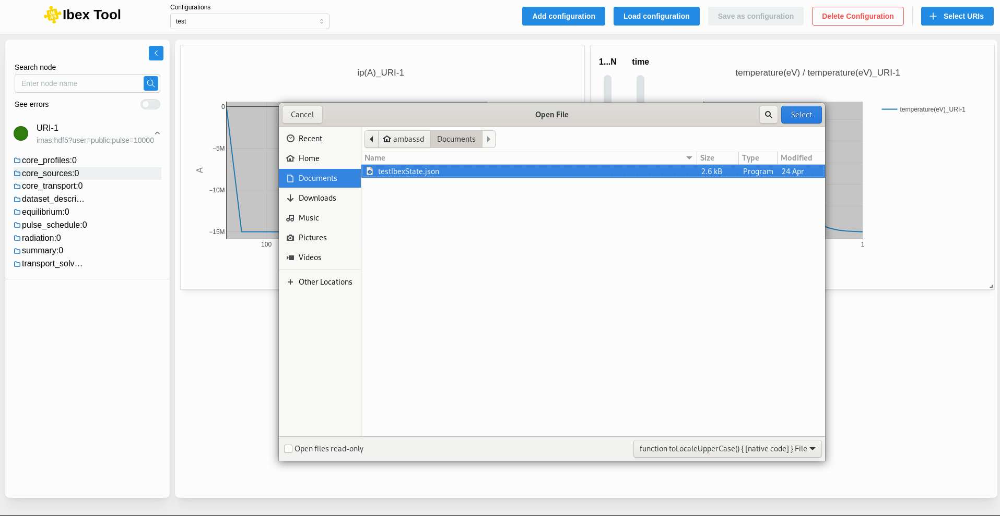

.. _`Save configuration`:

===================
Save configuration
===================

Using the "Save Configuration" button, the user can save their current setup to return to it later if needed. The configuration is saved in a .json file (see Configuration Example). This file can be edited manually, and any changes will be applied when the file is loaded.

Make sure to save your configuration if you want to access it again in the future.

The first time you save a configuration, a file explorer will open so you can choose the name and location of the configuration file. Once the file has been saved initially, clicking the button again will simply update the existing file.